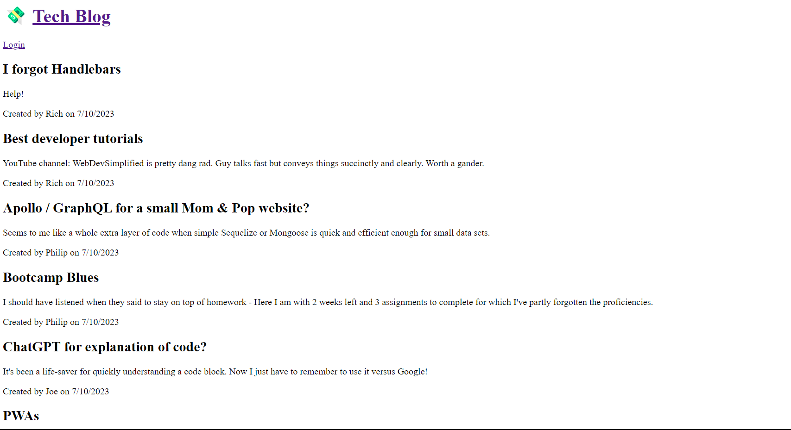

# Tech Blog

## Description

This bulletin-style Tech Blog was built for the Module 14 homework challenge for the Coding Bootcamp and UNC Chapel Hill.

In its current iteration, it does not quite meet all of the Acceptance Criteria of the assignment, however it does at least render the list of blog posts via the Routes and using the Handlebars views and SQL / Sequelize data models and includes a Login page.

## Installation

To load this program on your computer, simply navigate to the deployed app on Heroku at the following URL:

https://tech-blog-of-the-future-669e2c3a6107.herokuapp.com/

## Usage

After loading the app at the Heroku URL, follow these steps to use the app and see its functionality:

1 - On the Home screen, view a list of existing posts from the database.

2 - Click the Login button to either log in, or sign up

## Appearance

The following image shows the application's appearance:

## License

MIT License

Copyright (c) 2023 Peej D

Permission is hereby granted, free of charge, to any person obtaining a copy
of this software and associated documentation files (the "Software"), to deal
in the Software without restriction, including without limitation the rights
to use, copy, modify, merge, publish, distribute, sublicense, and/or sell
copies of the Software, and to permit persons to whom the Software is
furnished to do so, subject to the following conditions:

The above copyright notice and this permission notice shall be included in all
copies or substantial portions of the Software.

THE SOFTWARE IS PROVIDED "AS IS", WITHOUT WARRANTY OF ANY KIND, EXPRESS OR
IMPLIED, INCLUDING BUT NOT LIMITED TO THE WARRANTIES OF MERCHANTABILITY,
FITNESS FOR A PARTICULAR PURPOSE AND NONINFRINGEMENT. IN NO EVENT SHALL THE
AUTHORS OR COPYRIGHT HOLDERS BE LIABLE FOR ANY CLAIM, DAMAGES OR OTHER
LIABILITY, WHETHER IN AN ACTION OF CONTRACT, TORT OR OTHERWISE, ARISING FROM,
OUT OF OR IN CONNECTION WITH THE SOFTWARE OR THE USE OR OTHER DEALINGS IN THE
SOFTWARE.